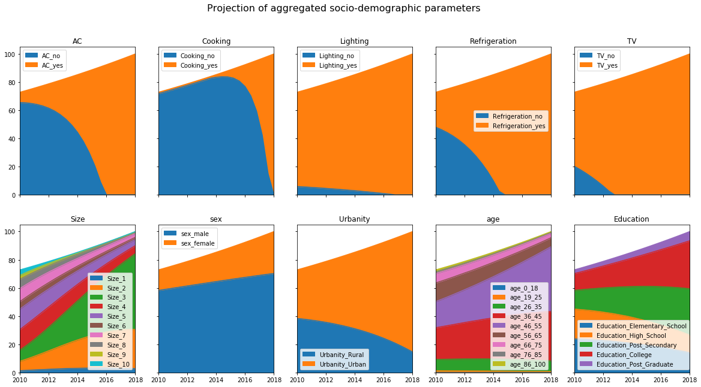

Spatial\ :math:`^{*}` Microsimulation Urban Metabolism Model (SMUM)
===================================================================

.. raw:: html

   

::

    

        
    

    

        
    

.. raw:: html

   

1.a Projecting demographic variables
====================================

`UN Environment <http://www.unep.org/>`__

.. code:: ipython3

    import datetime; print(datetime.datetime.now())

.. parsed-literal::

    2017-10-23 16:09:13.870555

**Notebook Abstract:**

This notebook show an example on how to prepare projected aggregated
benchmarks as well as how to introduce bias (a proxy for simulating
development scenarios at an aggregated level) to the benchmarks.

Aggregated census data
----------------------

.. code:: ipython3

    import pandas as pd
    from urbanmetabolism._scripts.aggregates import print_all

.. code:: ipython3

    census = pd.read_csv('data/benchmarks_projected.csv', index_col=0)
    skip = ['pop', 'Income', 'Water', 'Electricity']

.. code:: ipython3

    _ = print_all(
        census, 'year',
        var=False, skip = skip,
        total_pop = census.loc[:, 'pop'],
        set_xticks = False,
        title="Projection of aggregated socio-demographic parameters"
              )

.. image:: FIGURES_rst/Aa_ProjectionAggregates_6_0.png

Introduce bias to census data
-----------------------------

.. code:: ipython3

    bias_to = {
        'AC_yes': 1.17,
        'Cooking_yes': {2010: 1.01, 2020: 1.5},
        'Lighting_yes': 1.005,
        'Refrigeration_yes': 1.1,
        'TV_yes': 1.05,
        'Size_1': 1.05,
        'Size_2': 1.07,
        'Size_3': 1.07,
        'Size_4': 0.93,
        'Size_5': 0.92,
        'Size_6': 0.92,
        'Size_7': 0.92,
        'Size_8': 0.90,
        'Size_9': 0.88,
        'Size_10': 0.80,
        'sex_female':1.02,
        'Urbanity_Urban': 1.03,
        'age_26_35':1.03,
        'age_36_45':1.03,
        'age_46_55':1.03,
        'Education_Post_Secondary':1.05,
        'Education_College':1.04,
        'Education_Post_Graduate':1.03
    }

.. code:: ipython3

    _ = print_all(
        census, 'year_bias',
        var=False, skip = skip,
        bias = bias_to,
        total_pop = census.loc[:, 'pop'],
        title="Projection of aggregated socio-demographic parameters",
        save_data = 'data/benchmarks_year_bias.csv'
              )

.. raw:: html

   

::

    

        
    

    

        
    

.. raw:: html

   

1.a Projecting demographic variables
====================================

`UN Environment <http://www.unep.org/>`__

`Home <Welcome.ipynb>`__

`Next <Ab_MCMC_income.ipynb>`__ (1.b) Micro-level Income model
