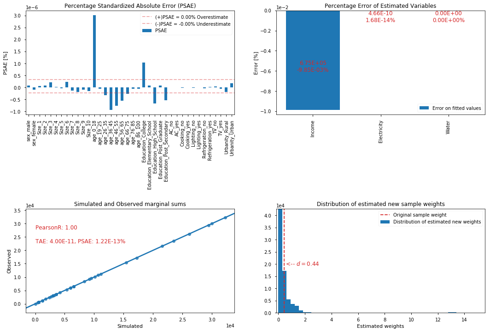

Synthetic Population (GREGWT)
=============================

UN Environment

.. code:: ipython3

    import datetime; print(datetime.datetime.now())

.. parsed-literal::

    2017-08-10 14:40:06.254256

.. code:: ipython3

    import pandas as pd
    %matplotlib inline

.. code:: ipython3

    from urbanmetabolism.population.model import plot_error

.. parsed-literal::

    /usr/lib/python3.6/site-packages/statsmodels/compat/pandas.py:56: FutureWarning: The pandas.core.datetools module is deprecated and will be removed in a future version. Please use the pandas.tseries module instead.
      from pandas.core import datetools

.. code:: ipython3

    pop = 32694 #households
    ind = 154678 #individuals
    year = 2010

.. code:: ipython3

    trace = pd.read_csv(
        'data/survey_Sorsogon_Electricity_Water_100000.csv', index_col=0)
    census = pd.read_csv('data/benchmarks.csv', index_col=0)
    #fit_cols = ['Income', 'Electricity','Water']
    #skip_cols = ['w', 'wf', 'level_0', 'index']

.. code:: ipython3

    def identify(var, sufix='e_'):
        cen_TV = census.loc[year ,[c for c in census.columns if var in c]]
        ces_val = cen_TV.div(cen_TV.sum())[var+'_yes']
        print('OK')
        try:
            new_TV = trace.loc[:,sufix+var].astype('category')
            trace_val = new_TV.value_counts()[1] / new_TV.shape[0]
        except:
            trace_val = np.nan
        print('census val = {:0.2f} \t trace value = {:0.2f}'.format(ces_val, trace_val))

.. code:: ipython3

    identify('AC')

.. parsed-literal::

    OK
    census val = 0.10 	 trace value = 0.10

.. code:: ipython3

    identify('Cooking')

.. parsed-literal::

    OK
    census val = 0.01 	 trace value = 0.01

.. code:: ipython3

    identify('Lighting')

.. parsed-literal::

    OK
    census val = 0.92 	 trace value = 0.92

.. code:: ipython3

    identify('Refrigeration')

.. parsed-literal::

    OK
    census val = 0.34 	 trace value = 0.34

.. code:: ipython3

    identify('TV')

.. parsed-literal::

    OK
    census val = 0.72 	 trace value = 0.72

.. code:: ipython3

    cen_urban = census.loc[year, [c for c in census.columns if 'Urbanity' in c]]
    cen_urban = cen_urban.div(cen_urban.sum())#['Urbanity_Urban']
    new_Urban = trace.loc[:,'e_Urban'].astype('category')
    trace_val = new_Urban.value_counts()[1] / new_Urban.shape[0]

.. code:: ipython3

    cen_urban

.. parsed-literal::

    Urbanity_Rural    0.527052
    Urbanity_Urban    0.472948
    Name: 2010, dtype: float64

.. code:: ipython3

    new_Urban.value_counts() /  new_Urban.shape[0]

.. parsed-literal::

    Urbanity_Urban    0.521254
    Urbanity_Rural    0.478746
    Name: e_Urban, dtype: float64

.. code:: ipython3

    REC = plot_error(trace, census, 
                     #skip_cols, fit_cols, 
                     pop = pop, save_all=False)

