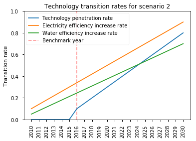

Spatial\ :math:`^{*}` Microsimulation Urban Metabolism Model (SMUM)
===================================================================

.. raw:: html

   

::

    

        
    

    

        
    

.. raw:: html

   

3.a Defining simple transition scenarios
========================================

`UN Environment <http://www.unep.org/>`__

.. code:: ipython3

    import datetime; print(datetime.datetime.now())

.. parsed-literal::

    2017-10-26 15:59:27.635709

**Notebook Abstract:**

The following notebook describes the process to construct simple
transition scenarios.

The transition scenarios are define as efficiency rates induced by
technology development. These rates can be used as proxies for all types
of efficiency improvements.

In order to define transition scenarios the model need the following
information:

1. A technology penetration rate. This defines the share of the
   population *adopting* the technology. The model uses
   ``sampling rules`` for the selection of the population adopting this
   technology.

2. Efficiency development rates. This define the actual technology
   development rate.

Import libraries
----------------

.. code:: ipython3

    from urbanmetabolism.population.model import growth_rate
    from urbanmetabolism.population.model import plot_growth_rate
    from urbanmetabolism.population.model import reduce_consumption

In order to compute the transition scenarios we make use of three
modules of the ``urbanmetabolism`` library:

1. ``growth_rate``. This module will return a vector with linear growth
   rates given a starting and end rate.

2. ``plot_growth_rate``. This a simple function to visualize the defined
   growth rates.

3. ``reduce_consumption``. This function creates new samples with
   reduced consumption levels for the selected selection of the
   population.

Define simple population selection rules
----------------------------------------

.. code:: ipython3

    sampling_rules = {
        "i_Education == 'Education_Post_Secondary'": 20,
        "i_Education == 'Education_College'":        20,
        "i_Education == 'Education_Post_Graduate'":  20,
        "i_Urbanity == 'Urbanity_Urban'":            30,
        "Income >= 180000":                          30
    }

Part of the scenario development is to identified which section of the
population will adopt the new technology. The model defined this by a
sampling probability. This probability is initially define as a uniform
distribution (i.e. each individual on the sample has equal probability
of being selected). A scenario is define by allocating new sampling
probabilities to section of the population by defining selection or
sampling rules. The sampling rules are passes to the
`query <http://pandas.pydata.org/pandas-docs/stable/generated/pandas.DataFrame.query.html>`__
function of a pandas ``DataFrame``.

On the example above, all individuals with a ``Income`` larger of equal
to 180000 Philippine Pesos are 30 times more likely to adopt the
technology that the rest of the population. The sampling probabilities
will sum up. This means that an individual with ``Income >= 180000`` and
living on an urban area ``e_Urban == 'Urbanity_Urban'`` is 60 times more
likely to be selected (i.e. adopt a new technology) that other
individuals.

.. code:: ipython3

    import pandas as pd
    file_name = "data/survey_Sorsogon_Electricity_Water_wbias_projected_dynamic_resampled_1000_{}.csv"
    sample_survey = pd.read_csv(file_name.format(2010), index_col=0)
    sample_survey.head()

.. raw:: html

    

    
    <table border="1" class="dataframe">
      <thead>
        <tr style="text-align: right;">
          <th></th>
          <th>index</th>
          <th>i_Sex</th>
          <th>i_Urbanity</th>
          <th>i_FamilySize</th>
          <th>i_Age</th>
          <th>i_Education</th>
          <th>e_Lighting</th>
          <th>e_TV</th>
          <th>e_Cooking</th>
          <th>e_Refrigeration</th>
          <th>e_AC</th>
          <th>Income</th>
          <th>Electricity</th>
          <th>Water</th>
          <th>w</th>
          <th>wf</th>
        </tr>
      </thead>
      <tbody>
        <tr>
          <th>0</th>
          <td>0</td>
          <td>sex_female</td>
          <td>Urbanity_Rural</td>
          <td>Size_7</td>
          <td>age_36_45</td>
          <td>Education_College</td>
          <td>Lighting_yes</td>
          <td>TV_no</td>
          <td>Cooking_no</td>
          <td>Refrigeration_no</td>
          <td>AC_no</td>
          <td>268187.065618</td>
          <td>73.724272</td>
          <td>176.917317</td>
          <td>33.914938</td>
          <td>63.360260</td>
        </tr>
        <tr>
          <th>1</th>
          <td>1</td>
          <td>sex_female</td>
          <td>Urbanity_Urban</td>
          <td>Size_5</td>
          <td>age_26_35</td>
          <td>Education_High_School</td>
          <td>Lighting_yes</td>
          <td>TV_yes</td>
          <td>Cooking_no</td>
          <td>Refrigeration_no</td>
          <td>AC_no</td>
          <td>188460.351488</td>
          <td>61.682521</td>
          <td>137.872051</td>
          <td>33.914938</td>
          <td>61.516392</td>
        </tr>
        <tr>
          <th>2</th>
          <td>2</td>
          <td>sex_male</td>
          <td>Urbanity_Urban</td>
          <td>Size_4</td>
          <td>age_76_85</td>
          <td>Education_High_School</td>
          <td>Lighting_yes</td>
          <td>TV_yes</td>
          <td>Cooking_no</td>
          <td>Refrigeration_no</td>
          <td>AC_no</td>
          <td>210561.848027</td>
          <td>70.225357</td>
          <td>157.295495</td>
          <td>33.914938</td>
          <td>25.686429</td>
        </tr>
        <tr>
          <th>3</th>
          <td>3</td>
          <td>sex_female</td>
          <td>Urbanity_Urban</td>
          <td>Size_4</td>
          <td>age_56_65</td>
          <td>Education_High_School</td>
          <td>Lighting_yes</td>
          <td>TV_yes</td>
          <td>Cooking_no</td>
          <td>Refrigeration_yes</td>
          <td>AC_no</td>
          <td>203062.522729</td>
          <td>77.266206</td>
          <td>150.001631</td>
          <td>33.914938</td>
          <td>31.996852</td>
        </tr>
        <tr>
          <th>4</th>
          <td>4</td>
          <td>sex_male</td>
          <td>Urbanity_Urban</td>
          <td>Size_4</td>
          <td>age_46_55</td>
          <td>Education_Elementary_School</td>
          <td>Lighting_yes</td>
          <td>TV_yes</td>
          <td>Cooking_no</td>
          <td>Refrigeration_yes</td>
          <td>AC_no</td>
          <td>150016.233618</td>
          <td>58.963442</td>
          <td>107.158722</td>
          <td>33.914938</td>
          <td>38.383759</td>
        </tr>
      </tbody>
    </table>
    

.. code:: ipython3

    Elec  = growth_rate(0.1 , 0.8 )
    Water = growth_rate(0.05, 0.2 )
    pr    = growth_rate(0.1 , 0.6, start=2016)

With help of the ``growth_rate()`` function we define the efficiency
growth rate and the technology penetration rate. For the technology
penetration rate we define the start year to be equal to the benchmark
year (2016). The function will automatically include the necessary zeros
at the beginning of the growth rate vector.

The function ``plot_growth_rate()`` allow us to visualize the predefined
efficiency growth rates and the technology growth rates.

.. code:: ipython3

    plot_growth_rate(
        {"Technology penetration rate": pr,
         "Electricity efficiency increase rate": Elec,
         "Water efficiency increase rate": Water},
         "scenario 1")

.. image:: FIGURES_rst/Ca_DefineTransitions_12_0.png

The actual modifications on the sample is performed by the
``reduce_consumption()`` function. The function requires as input the
following parameters:

1. A base file name for the samples (in case of implementing the
   resample method).

2. The sample year (in this case generated within the loop via
   ``range(2010, 2031)``.

3. The penetration rate for the sample year (iterated from vector
   ``pr``).

4. The predefined ``sampling_rules``.

5. A dictionary containing the efficiency rates for specific variables.
   (in this case for Electricity and Water).

6. A name for the scenario.

.. code:: ipython3

    for y, p, elec, water in zip(range(2010, 2031), pr, Elec, Water):
        _ = reduce_consumption(
            file_name,
            y, p, sampling_rules,
            {'Electricity':elec, 'Water':water},
            scenario_name = "scenario 1")

.. parsed-literal::

    00.00%   Electricity   reduction; efficiency rate 10.00%; year 2010 and penetration rate 00.00
    00.00%      Water      reduction; efficiency rate 05.00%; year 2010 and penetration rate 00.00
    00.00%   Electricity   reduction; efficiency rate 13.50%; year 2011 and penetration rate 00.00
    00.00%      Water      reduction; efficiency rate 05.75%; year 2011 and penetration rate 00.00
    00.00%   Electricity   reduction; efficiency rate 17.00%; year 2012 and penetration rate 00.00
    00.00%      Water      reduction; efficiency rate 06.50%; year 2012 and penetration rate 00.00
    00.00%   Electricity   reduction; efficiency rate 20.50%; year 2013 and penetration rate 00.00
    00.00%      Water      reduction; efficiency rate 07.25%; year 2013 and penetration rate 00.00
    00.00%   Electricity   reduction; efficiency rate 24.00%; year 2014 and penetration rate 00.00
    00.00%      Water      reduction; efficiency rate 08.00%; year 2014 and penetration rate 00.00
    00.00%   Electricity   reduction; efficiency rate 27.50%; year 2015 and penetration rate 00.00
    00.00%      Water      reduction; efficiency rate 08.75%; year 2015 and penetration rate 00.00
    03.54%   Electricity   reduction; efficiency rate 31.00%; year 2016 and penetration rate 00.10
    01.14%      Water      reduction; efficiency rate 09.50%; year 2016 and penetration rate 00.10
    05.28%   Electricity   reduction; efficiency rate 34.50%; year 2017 and penetration rate 00.14
    01.65%      Water      reduction; efficiency rate 10.25%; year 2017 and penetration rate 00.14
    07.23%   Electricity   reduction; efficiency rate 38.00%; year 2018 and penetration rate 00.17
    02.22%      Water      reduction; efficiency rate 11.00%; year 2018 and penetration rate 00.17
    09.52%   Electricity   reduction; efficiency rate 41.50%; year 2019 and penetration rate 00.21
    02.86%      Water      reduction; efficiency rate 11.75%; year 2019 and penetration rate 00.21
    12.11%   Electricity   reduction; efficiency rate 45.00%; year 2020 and penetration rate 00.24
    03.56%      Water      reduction; efficiency rate 12.50%; year 2020 and penetration rate 00.24
    14.76%   Electricity   reduction; efficiency rate 48.50%; year 2021 and penetration rate 00.28
    04.29%      Water      reduction; efficiency rate 13.25%; year 2021 and penetration rate 00.28
    17.59%   Electricity   reduction; efficiency rate 52.00%; year 2022 and penetration rate 00.31
    05.06%      Water      reduction; efficiency rate 14.00%; year 2022 and penetration rate 00.31
    20.83%   Electricity   reduction; efficiency rate 55.50%; year 2023 and penetration rate 00.35
    05.85%      Water      reduction; efficiency rate 14.75%; year 2023 and penetration rate 00.35
    24.19%   Electricity   reduction; efficiency rate 59.00%; year 2024 and penetration rate 00.39
    06.75%      Water      reduction; efficiency rate 15.50%; year 2024 and penetration rate 00.39
    27.86%   Electricity   reduction; efficiency rate 62.50%; year 2025 and penetration rate 00.42
    07.62%      Water      reduction; efficiency rate 16.25%; year 2025 and penetration rate 00.42
    31.90%   Electricity   reduction; efficiency rate 66.00%; year 2026 and penetration rate 00.46
    08.65%      Water      reduction; efficiency rate 17.00%; year 2026 and penetration rate 00.46
    36.11%   Electricity   reduction; efficiency rate 69.50%; year 2027 and penetration rate 00.49
    09.68%      Water      reduction; efficiency rate 17.75%; year 2027 and penetration rate 00.49
    40.18%   Electricity   reduction; efficiency rate 73.00%; year 2028 and penetration rate 00.53
    10.61%      Water      reduction; efficiency rate 18.50%; year 2028 and penetration rate 00.53
    44.69%   Electricity   reduction; efficiency rate 76.50%; year 2029 and penetration rate 00.56
    11.63%      Water      reduction; efficiency rate 19.25%; year 2029 and penetration rate 00.56
    49.36%   Electricity   reduction; efficiency rate 80.00%; year 2030 and penetration rate 00.60
    12.69%      Water      reduction; efficiency rate 20.00%; year 2030 and penetration rate 00.60

.. code:: ipython3

    Elec  = growth_rate(0.1 , 0.9 )
    Water = growth_rate(0.05, 0.7 )
    pr    = growth_rate(0.1 , 0.8, start=2016)

By modifying the we can create different scenarios.

.. code:: ipython3

    plot_growth_rate(
        {"Technology penetration rate": pr,
         "Electricity efficiency increase rate": Elec,
         "Water efficiency increase rate": Water},
         "scenario 2")

.. code:: ipython3

    for y, p, elec, water in zip(range(2010, 2031), pr, Elec, Water):
        _ = reduce_consumption(
            file_name,
            y, p, sampling_rules,
            {'Electricity':elec, 'Water':water},
            scenario_name = "scenario 2")

.. parsed-literal::

    00.00%   Electricity   reduction; efficiency rate 10.00%; year 2010 and penetration rate 00.00
    00.00%      Water      reduction; efficiency rate 05.00%; year 2010 and penetration rate 00.00
    00.00%   Electricity   reduction; efficiency rate 14.00%; year 2011 and penetration rate 00.00
    00.00%      Water      reduction; efficiency rate 08.25%; year 2011 and penetration rate 00.00
    00.00%   Electricity   reduction; efficiency rate 18.00%; year 2012 and penetration rate 00.00
    00.00%      Water      reduction; efficiency rate 11.50%; year 2012 and penetration rate 00.00
    00.00%   Electricity   reduction; efficiency rate 22.00%; year 2013 and penetration rate 00.00
    00.00%      Water      reduction; efficiency rate 14.75%; year 2013 and penetration rate 00.00
    00.00%   Electricity   reduction; efficiency rate 26.00%; year 2014 and penetration rate 00.00
    00.00%      Water      reduction; efficiency rate 18.00%; year 2014 and penetration rate 00.00
    00.00%   Electricity   reduction; efficiency rate 30.00%; year 2015 and penetration rate 00.00
    00.00%      Water      reduction; efficiency rate 21.25%; year 2015 and penetration rate 00.00
    03.88%   Electricity   reduction; efficiency rate 34.00%; year 2016 and penetration rate 00.10
    02.94%      Water      reduction; efficiency rate 24.50%; year 2016 and penetration rate 00.10
    06.40%   Electricity   reduction; efficiency rate 38.00%; year 2017 and penetration rate 00.15
    04.91%      Water      reduction; efficiency rate 27.75%; year 2017 and penetration rate 00.15
    09.33%   Electricity   reduction; efficiency rate 42.00%; year 2018 and penetration rate 00.20
    07.31%      Water      reduction; efficiency rate 31.00%; year 2018 and penetration rate 00.20
    12.75%   Electricity   reduction; efficiency rate 46.00%; year 2019 and penetration rate 00.25
    10.08%      Water      reduction; efficiency rate 34.25%; year 2019 and penetration rate 00.25
    16.59%   Electricity   reduction; efficiency rate 50.00%; year 2020 and penetration rate 00.30
    13.11%      Water      reduction; efficiency rate 37.50%; year 2020 and penetration rate 00.30
    20.68%   Electricity   reduction; efficiency rate 54.00%; year 2021 and penetration rate 00.35
    16.52%      Water      reduction; efficiency rate 40.75%; year 2021 and penetration rate 00.35
    24.95%   Electricity   reduction; efficiency rate 58.00%; year 2022 and penetration rate 00.40
    20.19%      Water      reduction; efficiency rate 44.00%; year 2022 and penetration rate 00.40
    29.83%   Electricity   reduction; efficiency rate 62.00%; year 2023 and penetration rate 00.45
    24.00%      Water      reduction; efficiency rate 47.25%; year 2023 and penetration rate 00.45
    34.92%   Electricity   reduction; efficiency rate 66.00%; year 2024 and penetration rate 00.50
    28.19%      Water      reduction; efficiency rate 50.50%; year 2024 and penetration rate 00.50
    40.58%   Electricity   reduction; efficiency rate 70.00%; year 2025 and penetration rate 00.55
    32.67%      Water      reduction; efficiency rate 53.75%; year 2025 and penetration rate 00.55
    46.71%   Electricity   reduction; efficiency rate 74.00%; year 2026 and penetration rate 00.60
    37.71%      Water      reduction; efficiency rate 57.00%; year 2026 and penetration rate 00.60
    53.20%   Electricity   reduction; efficiency rate 78.00%; year 2027 and penetration rate 00.65
    42.97%      Water      reduction; efficiency rate 60.25%; year 2027 and penetration rate 00.65
    59.41%   Electricity   reduction; efficiency rate 82.00%; year 2028 and penetration rate 00.70
    47.64%      Water      reduction; efficiency rate 63.50%; year 2028 and penetration rate 00.70
    66.38%   Electricity   reduction; efficiency rate 86.00%; year 2029 and penetration rate 00.75
    53.02%      Water      reduction; efficiency rate 66.75%; year 2029 and penetration rate 00.75
    73.59%   Electricity   reduction; efficiency rate 90.00%; year 2030 and penetration rate 00.80
    58.51%      Water      reduction; efficiency rate 70.00%; year 2030 and penetration rate 00.80

.. raw:: html

   

::

    

        
    

    

        
    

.. raw:: html

   

3.a Defining simple transition scenarios
========================================

`UN Environment <http://www.unep.org/>`__

`Home <Welcome.ipynb>`__

`Next <Cb_VisualizeTransitions.ipynb>`__ (3.b) Visualize transition
scenarios
