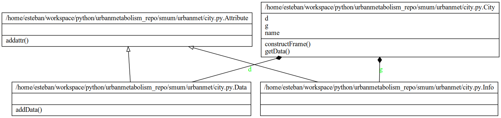
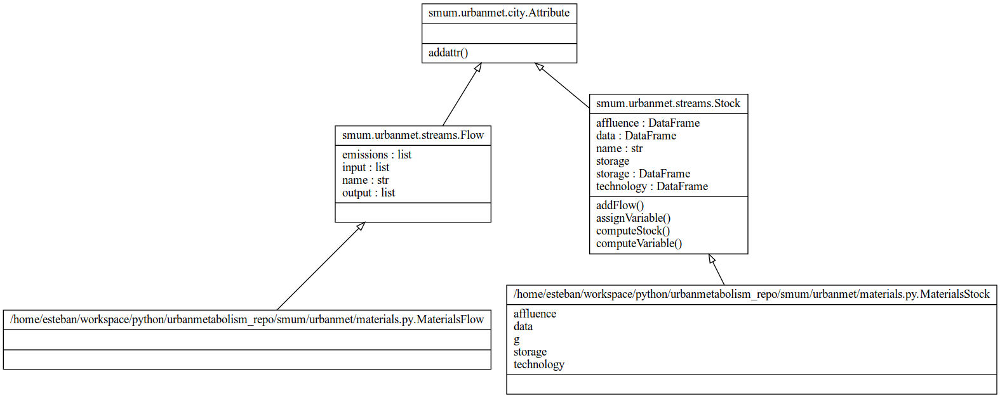
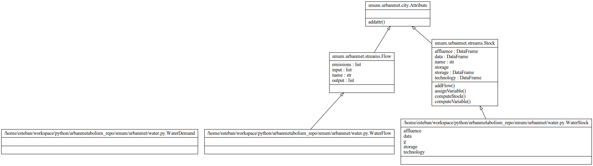
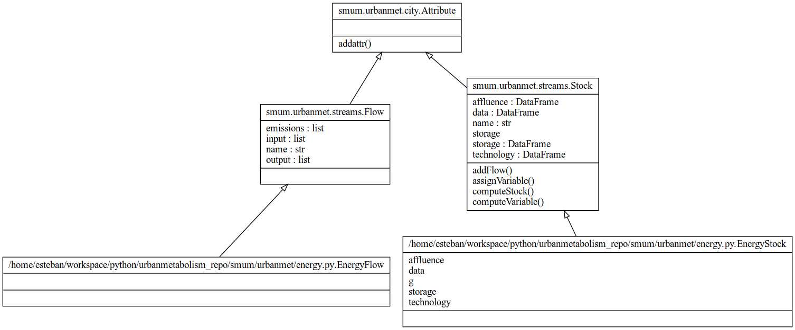
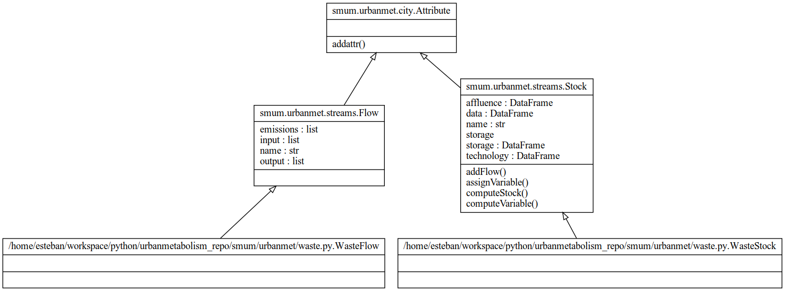

.. _um:

Top-Down: City-Systems (Urban Metabolism)
=========================================

The Urban Metabolism module aims to describe the resources flows of
a city-system at an aggregated level with the use of input-output tables.

This module aims to:

  1. A framework for the description of resources flows;
  2. A description of macro-level drivers for the changes of these flows; and
  3. A description of linkages between resources flows.

The main idea of this library module--and of this python library-- is that each
module can be use independently. The UM module can be run independently from
the rest of the library.

The library is structured as two types of functions:

  1. A function dedicated to the description of a city and city-data, see :ref:`city`.
  2. Resources flow specific classes:

     - :ref:`materials`
     - :ref:`water`
     - :ref:`energy`
     - :ref:`food`
     - :ref:`waste`

For each of this classes a Unified Modeling Language (UML_) class diagram has
been generated.

The description of the individual functions of this module can be found below
under: :ref:`um-api`.

.. _um-api:

Top-Down: API (Urban Metabolism)
=========================================

.. _city:

City
------------

   City class diagram.

.. autoclass:: urbanmet.city.City
   :members:
   :special-members:
   :private-members:

.. _materials:

Materials
------------

   Materials class diagram.

.. autoclass:: urbanmet.materials.MaterialsFlow
   :members:
   :special-members:
   :private-members:

.. autoclass:: urbanmet.materials.MaterialsStock
   :members:
   :special-members:
   :private-members:

.. _water:

Water
------------

   Water class diagram.

.. autoclass:: urbanmet.water.WaterDemand
   :members:
   :special-members:
   :private-members:

.. autoclass:: urbanmet.water.WaterFlow
   :members:
   :special-members:
   :private-members:

.. autoclass:: urbanmet.water.WaterStock
   :members:
   :special-members:
   :private-members:

.. _energy:

Energy
------------

   Energy class diagram.

.. autoclass:: urbanmet.energy.EnergyFlow
   :members:
   :special-members:
   :private-members:

.. autoclass:: urbanmet.energy.EnergyStock
   :members:
   :special-members:
   :private-members:

.. _food:

Food
------------

   Food class diagram.

.. autoclass:: urbanmet.food.FoodFlow
   :members:
   :special-members:
   :private-members:

.. autoclass:: urbanmet.food.FoodStock
   :members:
   :special-members:
   :private-members:

.. _waste:

Waste
------------

   Waste class diagram.

.. autoclass:: urbanmet.waste.WasteFlow
   :members:
   :special-members:
   :private-members:

.. autoclass:: urbanmet.waste.WasteStock
   :members:
   :special-members:
   :private-members:

.. _UML: https://en.wikipedia.org/wiki/Unified_Modeling_Language
