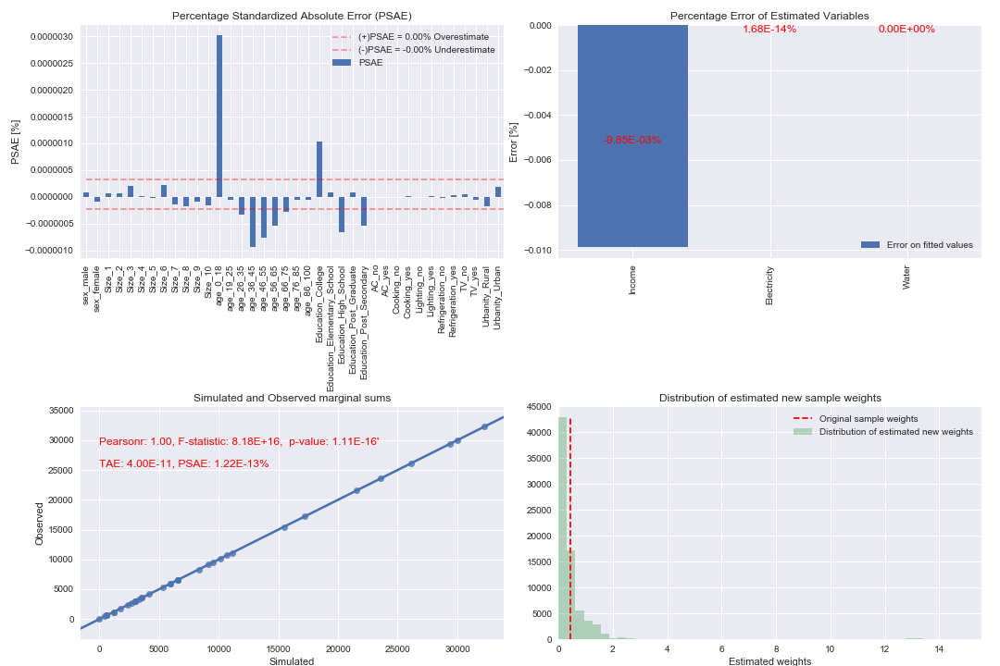
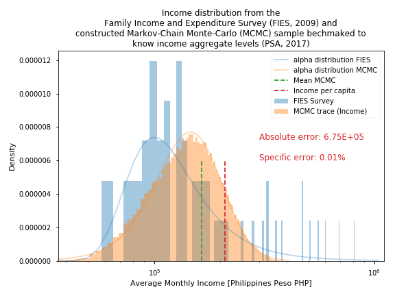

Bottom-Up: Synthetic Populations (Spatial Microsimulation)
==========================================================

The presented simulation framework on this report implements a simple model for
the description of urban resources flow and their projection into the future
under predefined scenarios.

The simulation framework is constructed as a hybrid model. The Model balances
input-output tables at an aggregated level, its contra-part model module
computes consumption levels at a micro-level. In order to describe the
consumption of resources at a micro-level the model requires a micro-data-set.
For a traditional analysis, the implemented micro-data-set would be a survey
that is: (a) representative of the underlying population and (b) that contains
parameters required for the estimation of consumption intensities.
A traditional approach would simply reweight this survey to the analysis area
(in this case a particular city) and re-compute the consumption levels. The
problem with this approach are following: (1) this approach requires a detail
survey for the specific resource to be estimated; (2) the survey is not
representative for the projection of the population and (3) the method does not
allow for an integrated analysis, i.e. combining variables from different
surveys. The second point can be solved through the implementation of a dynamic
population model at the expense of detail data input requirements.

The presented approach solves all three problems of the traditional approach by
constructing a synthetic sample via a Markov-Chain-Monte-Carlo (MCMC) sampling
procedure. Instead of using a sample survey as input the model defines
probability distributions for the individual variables. The probability
distributions can be defined based on variables from a sample survey but can
also be derived from other data sources. Because the sample survey is
synthetically constructed it can be re-constructed on each simulation step, by
doing this the synthetic sample survey is always representative to the
underlying population. The constructing of a sample survey at each simulation
step comes at the cost of computational time. The synthetic sample survey is
benchmarked to know aggregated demographic variables—and consumption values is
available—with help of a sample reweighting algorithm (GREGWT).

The simulation framework
------------------------

The first step of the simulation framework is the construction of the synthetic
sample survey, the second step, GREGWT, reweights this sample to aggregated
statistics. This means that the weight for each record is recomputed. The
sample starts with a uniform distributed weight, e.g. every record represents
5 households. This means that the sample size (number of records on the sample)
is five times smaller than the actual number of households. The sample size can
be redefined to any given number, this means that the sample size can be larger
than the total number of households. The GREWT algorithm will re-compute these
weights in order to match them to know aggregates. This procedure assures that
the marginal sums of the sample survey match aggregated statistics. For
example, from the national statistics the model knows that at a given city
there are 100 households that do not have air conditioning, GREGWT will make
sure that when we sum the weight of all household in the synthetic sample
survey that do not have air conditioning will be equal to 100.

This procedure is performed at each simulation step. A disadvantage of
performing these steps (MCMC + GREGWT) at each simulation step is that the MCMC
algorithm is very computational intensive. Depending on the defined simulation
scenarios a simpler method can be applied. Instead of resampling on each
simulation step (MCMC + GREGWT; resampling method) the model can resample once,
e.g: for a benchmark year, and reweight this sample for each consequent
simulation year (reweighting method).

Figure 21 and Figure 22 show the previously described Income-Electricity
relationship (see Figure 20) for different simulation years, representing the
weight factor as the size of the point. Figure 21 shows the estimated weights
implementing the reweighting method while Figure 22 shows the estimated weights
implementing the resampling method (MCMC + GREGWT for each simulation year).

Benchmark year
~~~~~~~~~~~~~~

The plot at the upper-right corner of both graphs represent the weights for the
benchmarked year (2016). The model can define a benchmark year, for which it
will calibrate the estimation results. The benchmark year is defined by giving
the model a known value for the resource consumption at an aggregated level.
The model will calibrate the sample by making sure that the sum of the
synthetic sample consumption levels matches the levels of the benchmark year.
This means that the model needs to have aggregated consumption levels for the
benchmark year. The model computes a calibration k-factor for this benchmark
year, this calibration factor is used for all the other simulation years.

Weights development
~~~~~~~~~~~~~~~~~~~~

The weights development through simulation years implementing the different
method can be clearly seen on Figure 21 and Figure 22. As described before the
problem of the reweighing implementation is that the constructed sample is no
longer representative for years at which the aggregated values significantly
differed from the benchmark year. This can be clearly seen at the lower-right
plot of Figure 21, the GREGWT algorithm drop many not representative records
(i.e. sets the weight to zero) and compensates by allocating a large weight to
individual records (large bubbles on the plot). In comparison, the weights of
the constructed sample implementing the sampling method (Figure 22) do not need
to drop record or allocate large weights to individual records.

Internal and external model error
---------------------------------

Figure 23, Figure 24, Figure 25 and Figure 26 show a graph describing the model
error. The upper-right plot shows the Percentage Specific Absolute Error (PSAE)
error for each variable category, this value measures the distance between
estimated and known (or extrapolated) aggregated values. The upper-right plot
shows the percentage deviation between estimated consumption levels and known
consumption levels (the plots for Figure 24 and Figure 26 are empty because
known consumption levels are only available for benchmark year 2016). The
lower-right plot shows a regression line between simulated values (x-axis) and
observed values (y-axis). Observed values are the know or extrapolated values
at an aggregate level. The lower-right plot shows the initial uniform
distributed weight (dotted red line, output of MCMC) and the reweighted weights
distribution (output of GREGWT).

Figure 23 and 24 shows the model error implementing the resampling method for
benchmark year 2016 and simulation year 2030 correspondingly. Figure 25 and
Figure 26 show the model error for the same years implementing the reweighting
method.

In this case the reweighting method is not suitable for simulating the propose
scenario. The PSAE error allocated to variable “AC” (does the family has an AC
at home) has an internal error of more than 25%. This means that 25% of
families in the sample are allocated to the wrong category. Because this
variable is an important driver of energy consumption (see Figure 20).

   Simulation error

Running a Simple Example
-------------------------

The following steps are required to construct a minimal simulation example.

1. Define model parameters.
2. We define a formula for the Electricity model. This model will compute the
   electricity demand based on previously computed income levels.
3. We define a python dictionary to tell the function `run_calibrated_model` how
   to calibrate it. The order to the models (i.e. dictionary keys) matter, as
   the model will calibrate them in the specified order. In this case we need
   to calibrate the income model first in order to calibrate the electricity
   model because the computation of electricity directly depends on the
   estimation of income.
4. We run the model with the defined parameters. The model with iterate until
   all models are calibrated.

.. code:: python

  # load libraries
  import pandas as pd
  from urbanmetabolism.population.model import run_calibrated_model

  # load model coefficients
  elec  = pd.read_csv('data/test_elec.csv',   index_col=0)
  inc   = pd.read_csv('data/test_inc.csv',    index_col=0)
  water = pd.read_csv('data/test_water.csv',  index_col=0)

  # define model, order matters
  model = {"Income":      {'table_model': inc },
           "Water":       {'table_model': water},
           "Electricity": {'table_model': elec}}

  # run simulation
  run_calibrated_model(
      model,
      census_file = 'data/benchmarks_projected.csv',
      year = 2016)

This subsection describes the required steps to perform a simple simulation.
The steps to perform a simulation are twofold:

1) The definition of a consumption model; and
2) The construction of scenarios

The definition of consumption models is required for the estimation of
consumption levels at a micro level. The consumption models estimate resource
consumption intensities at an individual level based on predefined consumption
drivers. The consumption model implemented in the simulation can be any time of
resource demand model.

The definition of scenarios is performed at an aggregate level (simple
scenario) or at a micro level (advanced scenario). The construction of simple
scenarios is performed by extrapolating the driver variables at an aggregated
level. An advance scenario updates the consumption model itself for each
simulation year.

Consumption models
~~~~~~~~~~~~~~~~~~

In order to explain the consumption of resources at a micro level the model
requires a defined consumption model. Table 22 list the input data passes to
the urban metabolism model, defining the model used for the estimation of
income. Income levels are subsequently used for the estimation of electricity
and water demand.

For the construction of a sample survey the model requires a set of parameters
for each variable:

1. Mean value of variable coefficient [co_mu]

   This is the mu value used to define a sampling probability distribution
   (normal distributed) for the variable coefficient.

   This coefficient indicates the effect the variable has on income.

   If the variable is defined as categorical (see parameter dis) the model
   requires a co_mu value for each category.

   If the variable is defined as deterministic (see parameter dis) the model
   requires no co_mu value.

2. Standard deviation of variable coefficient [co_sd]

   The second parameter the model need to define a normal distribution is the
   standard deviation of the sampling probability distribution.

   With the values of co_mu and co_sd the model constructs a normal distribution.
   The model will take samples based on this distribution.

   If the variable is defined as categorical (see parameter dis) the model
   requires a co_sd value for each category.

   If the variable is defined as deterministic (see parameter dis) the model
   requires no co_sd value.

3. Probability value for dichotomous variables (single value) or categorical distributions (probability vector) [p]

   For dichotomous variables (yes/no, female/male, 1/0, etc.…) a single value
   is assigned to parameter p. Parameter p is the probability for the variable
   to take one of these values.

   The p value of the first row of Table 22 is set to 0.19. This means that at
   simulation year 2010 the model will sample a household with a female head
   (male is the reference category, see Figure 16) with a 19% probability.

   If the expected variable is categorical (high\middle/low, 1/2/3, etc.) the
   value assign to parameter p is a vector with size equal to the number of
   categories.

4. Mean value of distribution [mu]

   This is the mu value used to define a sampling probability distribution for
   the variable value.

   This parameter has to be define for either continuous variables (normal
   distribution) of for discrete variables (poisson distribution).

5. Standard deviation for distribution [sd]

   For continuous distributed variables (normal distribution) the model need to
   define a value for its standard deviation.

6. A distribution type [dis]

   This parameter defines the sampling probability distribution for the
   variable values. The Markov-Chain-Monte-Carlo routine will use this
   distribution (define through parameters mu and sd) to sample the variables
   values.

   The variables coefficients are by default sampled along a normal
   distribution, defined by co_mu and co_sd.

7. An upper bound [ub]

   An optional Upper Bound defined by parameter ub can be imputed into the
   simulation model. This parameter will cap the sampled variable value at this
   value.

8. A lower bound [lb]

   Identical to parameter ub but for the lower bound of the sampled variable.

.. table:: Income table-model for Sorsogon City (benchmark year 2016)

  +------------------+--------------------+----------------+----------+-----------+---------+---------------+----+----+
  |                  | co_mu              | co_sd          | p        | mu        | sd      | dis           | ub | lb |
  +==================+====================+================+==========+===========+=========+===============+====+====+
  | **i_Intercept**  |                    |                | 1,147.66 |           |         | Deterministic |    |    |
  +------------------+--------------------+----------------+----------+-----------+---------+---------------+----+----+
  | **i_Sex**        | 919.01             | 161.50         | 0.20     | Bernoulli |         |               |    |    |
  +------------------+--------------------+----------------+----------+-----------+---------+---------------+----+----+
  | **i_Urbanity**   | 7,105.22           | 127.94         | 0.47     | Bernoulli |         |               |    |    |
  +------------------+--------------------+----------------+----------+-----------+---------+---------------+----+----+
  | **i_FamilySize** | 1,666.85           | 29.03          | 5.25     | 2.24      | Poisson | 10            | 1  |    |
  +------------------+--------------------+----------------+----------+-----------+---------+---------------+----+----+
  | **i_Age**        | 116.58             | 4.68           | 54.18    | 14.07     | Normal  | 100           | 18 |    |
  +------------------+--------------------+----------------+----------+-----------+---------+---------------+----+----+
  | **i_Education**  | 1.0, ..., 16788.04 | 0.0, ..., 742. |          |           |         |               |    |    |
  +------------------+--------------------+----------------+----------+-----------+---------+---------------+----+----+

The defined income model estimates income levels at household level. The
variables used for the estimation are:

1. Gender of the household head

   This variable defined the gender of the household head. The model assumes
   a 919.01 increase in household income if the household head is female. The
   model will construct a synthetic sample where 20% of all household heads are
   female.

2. Urbanity

   Defines if the household is classified as urban or rural. The category
   “rural” is used as reference category. The coefficient describes a positive
   influence on income, urban households are attributed on average 7 105.22
   Philippine-Pesos with a standard deviation of 127.94 Pesos.

3. Family size

   The impact of family income by household size if of 1666.85 Pesos per
   additional family member.

4. Age of head of household

   The age of the household head is modelled as a continues variable. This is
   defined by setting the parameter dis to “Normal” (the normal distribution is
   a continuous distribution). The shape of the distribution is defined by
   variable mu and sd.

   The impact of household head age on income is define by parameter co_mu, set
   to 116.58 with a standard deviation of 4.68 (via parameter sd).

5. Education level of head of household

   The education level of the household head also impacts the income level of
   the household. In this case the model defines this variable as categorical.
   For each category the impact on income, relative to the reference level
   (Elementary School), has to be define on parameter co_mu.

   The model will create a synthetic sample following these parameters. On
   a second step, the model calibrates the estimated income levels to a known
   income value i.e. the aggregated total income of the city.

   Prior income distribution and calibrate posterior distribution

Figure 27 shows the histogram of the original data used in the regression
model, required for the estimation of regression coefficients used on variable
co_mu, the known income level for 2016 (dotted green line) and the histogram of
the constructed sample survey income levels. The figure also shows the absolute
and specific error of the calibration. The estimated total income, i.e. the sum
of all households’ income in the synthetic sample survey differs by 0.01% from
the official total income of the city reported on 2016. This means that the
income estimation of the model has been calibrated properly. The computed
calibration k-factor is used for the estimation of income for all other
simulation years.

Following this schema, the model is able to compute all type of variables. On
this section, the model is implemented for the estimation of electricity
consumption levels as well as water consumption levels. The estimation of water
and electricity consumption makes use of previously estimated income levels for
their computation as well as demographic variables sampled for the estimation
of income levels.

.. table:: Electricity table-model

  +---------------------+--------+---------------+------+-----------+------+-----+
  |                     | co_mu  | co_sd         | p    | ub        | lb   | dis |
  +=====================+========+===============+======+===========+======+=====+
  | **e_Intercept**     | 3.30   | Deterministic |      |           |      |     |
  +---------------------+--------+---------------+------+-----------+------+-----+
  | **e_Lighting**      | 0.83   | 18.67         | 0.92 | Bernoulli |      |     |
  +---------------------+--------+---------------+------+-----------+------+-----+
  | **e_TV**            | 18.79  | 1.76          | 0.72 | Bernoulli |      |     |
  +---------------------+--------+---------------+------+-----------+------+-----+
  | **e_Cooking**       | 28.89  | 1.97          | 0.01 | Bernoulli |      |     |
  +---------------------+--------+---------------+------+-----------+------+-----+
  | **e_Refrigeration** | 59.24  | 1.56          | 0.34 | Bernoulli |      |     |
  +---------------------+--------+---------------+------+-----------+------+-----+
  | **e_AC**            | 203.32 | 3.13          | 0.10 | Bernoulli |      |     |
  +---------------------+--------+---------------+------+-----------+------+-----+
  | **e_Urban**         | 24.59  | 1.39          | 1.00 | Bernoulli |      |     |
  +---------------------+--------+---------------+------+-----------+------+-----+
  | **e_Income**        | 0.00   | 0.00          | inf  | 0.00      | None |     |
  +---------------------+--------+---------------+------+-----------+------+-----+

.. figure:: ./_static/images/Electricity.png
   :align: center
   :scale: 100%

   Estimated electricity distribution

Table 23 describes the implemented model for the estimation of electricity
demand. Analogues to the model defined for the estimation of income, the table
list a set of variables used for the estimation of electricity consumption.
These variables are described by their distribution (required for sampling
them) and their coefficients.

The variables used on this example for the estimation of electricity
consumption are the following (see Figure 17 for the corresponding regression
analysis):

1) AC

   This variable is one of the most import variables for the estimation of
   electricity consumption levels of individual households.

   This variable describes the use of Air Conditioning on the household for cooling.

2) Cooking

   This variable describes the impact on electricity demand of using an electric device for cooking.

3) Lighting

   This variable indicated the use of electric energy for the lighting of the
   house. This variable is directly related to electrification rate. By 2016 it
   is assumed that 97% of all households use electric energy for the lighting
   of their house.

4) Refrigeration

   This variable describes the use of electricity for refrigeration. Similar to
   the lighting variable, the model assumes that by 2016 all households use
   electric energy for refrigeration.

5) TV

   This variable describes the use of electricity for TV and other leisure
   electric equipment like radios, computers and mobile phones.

6) Urban

   Analogues to the income estimation, the urbanization of a household has an
   impact on its electricity consumption.

   For 2016 the model assumes an urbanization rate of 65%.

Similar to the estimation of income, the estimation electricity is calibrated
to the known city level electricity consumption level for the residential
sector. Figure 28Figure 28 shows the estimation error of the model by comparing
the calibrated estimated electricity consumption values from the synthetic
sample survey to the consumption values from the Household Energy Consumption
Survey HECS (PSA, 2004). The specific estimation error is close to zero with
a value of 1.83e-4% (0.000183%).

.. table:: Water table-model

  +---------------------------+-----------------+------------------+-----------------+--------------------+------+-----+
  |                           | co_mu           | co_sd            | p               | mu                 | sd   | dis |
  +===========================+=================+==================+=================+====================+======+=====+
  | **w_Intercept**           | -601.59         | Deterministic    |                 |                    |      |     |
  +---------------------------+-----------------+------------------+-----------------+--------------------+------+-----+
  | **w_Sex**                 | 98.50           | 29.44            | 0.20            | None               |      |     |
  +---------------------------+-----------------+------------------+-----------------+--------------------+------+-----+
  | **w_Urbanity**            | 1,000.98        | 25.42            | 0.47            | None               |      |     |
  +---------------------------+-----------------+------------------+-----------------+--------------------+------+-----+
  | **w_Total_Family_Income** | 0.05            | 0.00             | None            |                    |      |     |
  +---------------------------+-----------------+------------------+-----------------+--------------------+------+-----+
  | **w_FamilySize**          | 49.74           | 5.90             | 5.25            | 2.24               | None |     |
  +---------------------------+-----------------+------------------+-----------------+--------------------+------+-----+
  | **w_Age**                 | 6.09            | 0.91             | 54.18           | 14.07              | None |     |
  +---------------------------+-----------------+------------------+-----------------+--------------------+------+-----+
  | **w_Education**           | 1.0, ..., 40.19 | 0.0, ..., 119.68 | 0.33, ..., 0.04 | None;i;Categorical |      |     |
  +---------------------------+-----------------+------------------+-----------------+--------------------+------+-----+
