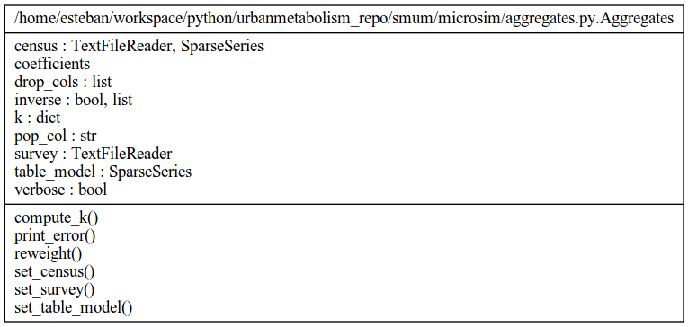
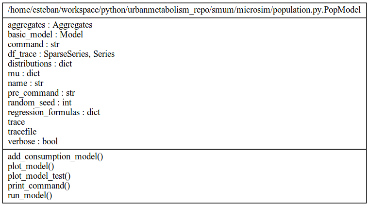
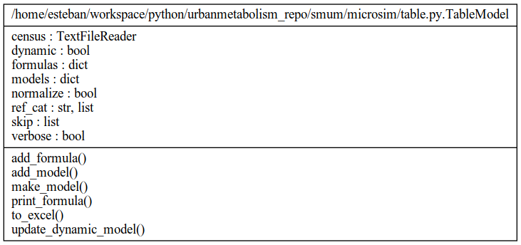

.. _sm:

Bottom-Up: Synthetic Populations (Spatial Microsimulation)
==========================================================

The presented simulation framework on this report implements a simple model for
the description of urban resource flows and their projection into the future
under predefined scenarios.

The simulation framework is constructed as a hybrid model. The Model balance
input-output tables at an aggregated level, its contra-part module
computes consumption levels at a micro-level. In order to describe the
consumption of resources at a micro-level, the model requires a micro-data-set for the construction of a consumption model.
For a traditional analysis, the implemented micro-data-set would be a survey
that: a) is representative of the underlying population and b)  contains
parameters required for the estimation of consumption intensities.
A traditional approach would simply reweight this survey to the analysis area
(in this case a specific city) and re-compute the consumption intensities. The
problems with this approach are following: 1) this approach requires a detail
survey for the specific resource to be estimated; 2) the survey is not
representative for the projection of the population and 3) the method does not
allow for an integrated analysis, i.e. combining variables from different
surveys. The second point can be solved through the implementation of a dynamic
population model at the expense of a considerable increase in data input requirements.

The presented approach solves all three problems of the traditional approach by
constructing a synthetic sample via a Markov-Chain-Monte-Carlo (MCMC) sampling
procedure. Instead of using a sample survey as input the model defines
probability distributions for the individual variables (and eventually links between these variables). The probability
distributions can be defined based on variables from a sample survey but can
also be derived from other data sources. Because the sample survey is
synthetically constructed it can be re-constructed on each simulation step, by
doing this the synthetic sample survey is always representative of the
underlying population. The constructing of a sample survey at each simulation
step comes at the cost of computational time. The synthetic sample survey is
benchmarked to know aggregated demographic variables—and consumption values if
available—with help of a sample reweighting algorithm (GREGWT).

The simulation framework
------------------------

The first step of the simulation framework is the construction of the synthetic
sample survey via the MCMC algorithm.
On the second step, GREGWT reweights this sample to aggregated
statistics. This means that the weight for each record is recomputed. The
sample starts with a uniform distributed weight, e.g. every record represents
$w$ number of households. This means that the difference between the sample size :math:`n` (number of records on the sample)
and the actual number of households :math:`N_{HH}` is equal to :math:`n \times w`,
The sample size can
be redefined to any given number, this means that the sample size can be larger
than the total number of households. The GREWT algorithm will re-compute these
weights in order to match them to know aggregates. This procedure assures that
the marginal sums of the sample survey match aggregated statistics. For
example, from the national statistics the model knows that on a specific city
there are 100 households that do not have air conditioning, GREGWT will make
sure that when we sum the weight of all households in the synthetic sample
survey that do not have air conditioning will be equal to 100.

This procedure is performed at each simulation step. A disadvantage of
performing these steps (MCMC + GREGWT) at each simulation step is that the MCMC
algorithm is very computationally intensive. Depending on the defined simulation
scenarios a simpler method can be applied. Instead of resampling on each
simulation step (MCMC + GREGWT; resampling method) the model can resample once,
e.g: for a benchmark year, and reweight this sample for each consequent
simulation year (reweighting method).

Internal and external model error
---------------------------------

:numref:`fig_error`
shows a graph describing the model
error. The upper-right plot shows the Percentage Specific Absolute Error (PSAE)
error for each variable category, this value measures the distance between
estimated and known (or extrapolated) aggregated values. The upper-right plot
shows the percentage deviation between estimated consumption levels and known
consumption levels (the plots for Figure 24 and Figure 26 are empty because
known consumption levels are only available for benchmark year 2016). The
lower-right plot shows a regression line between simulated values (x-axis) and
observed values (y-axis). Observed values are the know or extrapolated values
at an aggregate level. The lower-right plot shows the initial uniform
distributed weight (dotted red line, the output of MCMC) and the reweighted weights
distribution (output of GREGWT).

.. _fig_error:
.. figure:: ./_static/images/error_total.png
   :align: center
   :scale: 100%

   Internal simulation error

.. _sm-api:

Bottom-Up: API (Spatial Microsimulation)
==========================================================

.. autofunction:: microsim.run.run_calibrated_model

.. autofunction:: microsim.run.run_composite_model

.. autofunction:: microsim.run.transition_rate

.. autofunction:: microsim.run.reduce_consumption

.. autofunction:: microsim.util_plot.cross_tab

.. autofunction:: microsim.util_plot.plot_data_projection

.. autofunction:: microsim.util_plot.plot_error

.. autofunction:: microsim.util_plot.plot_projected_weights

.. autofunction:: microsim.util_plot.plot_transition_rate

   Aggregates class diagram.

.. autoclass:: microsim.aggregates.Aggregates
   :members:

   Population class diagram.

.. autoclass:: microsim.population.PopModel
   :members:

   Table class diagram.

.. autoclass:: microsim.table.TableModel
   :members:
